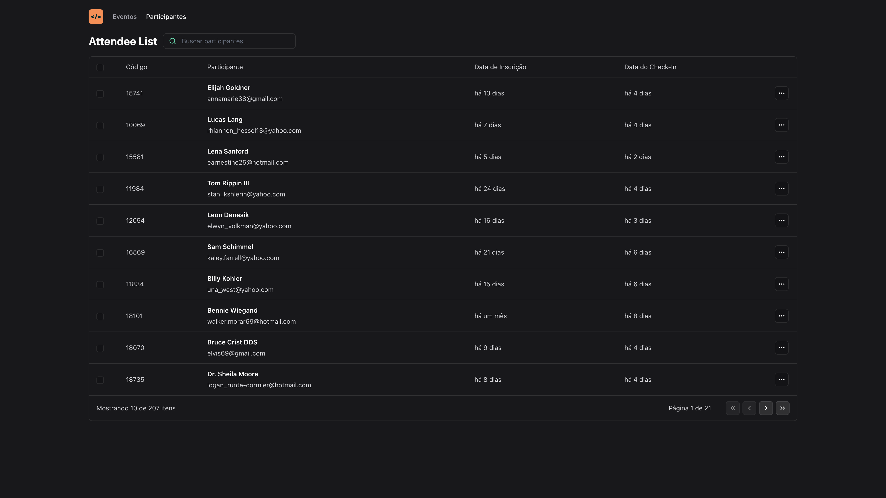

# NLW Unite - Pass-In-Web

Development of a front-end application in ReactJS, applying concepts of Properties, States, and Components, typing with Typescript, tooling with Vite, responsive interface with TailwindCSS, consumption of Node.js API, and utilization of URL states.

This is a solution to the [IP address tracker challenge on Frontend Mentor](https://www.frontendmentor.io/challenges/ip-address-tracker-I8-0yYAH0). Frontend Mentor challenges help you improve your coding skills by building realistic projects. 

## Table of contents

- [Overview](#overview)
  - [The challenge](#the-challenge)
  - [Screenshot](#screenshot)
  - [Links](#links)
- [My process](#my-process)
  - [Built with](#built-with)
- [Author](#author)


## Overview

### The challenge

Users should be able to:

- View the optimal layout for each page depending on their device's screen size
- See hover states for all interactive elements on the page
- See their own IP address on the map on the initial page load
- Search for any IP addresses or domains and see the key information and location

### Screenshot




### Links

- Solution URL: [https://github.com/jefferson-gbarbosa/ip-address-tracker](https://github.com/jefferson-gbarbosa/ip-address-tracker)
- Live Site URL: [https://jefferson-gbarbosa.github.io/ip-address-tracker/](https://jefferson-gbarbosa.github.io/ip-address-tracker/)

## My process

### Built with

- Semantic HTML5 markup
- CSS custom properties
- Flexbox
- API

## Author

- Linkedin - [jefferson-gbarbosa](https://www.linkedin.com/in/jefferson-gbarbosa/)
- Frontend Mentor - [@jefferson-gbarbosa](https://www.frontendmentor.io/profile/jefferson-gbarbosa)
- Twitter - [@JeffGoncalves42](https://twitter.com/JeffGoncalves42)


<h1 align="center">NLW Unite</h1>

<p align="center">Development of a front-end application in ReactJS, applying concepts of Properties, States, and Components, typing with Typescript, tooling with Vite, responsive interface with TailwindCSS, consumption of Node.js API, and utilization of URL states.</p>

<br />

## Screenshots

#### Attendee


#### Search


<br />

## Running the Application

<a href="https://nlw-unite.netlify.app" target="_blank">Access the Project's website by clicking here.</a>

```
https://nlw-unite.netlify.app
```

<br />
<i>Follow the steps to run the Project on your local machine.</i>
<br />

#### Requirements

- [Node](https://nodejs.org/en/)
- [Yarn](https://classic.yarnpkg.com/lang/en/) or [Npm](https://www.npmjs.com/)

#### Clone the repository and navigate to the folder

```
$ git clone https://github.com/MatheusPalmieri/nlw-unite && cd nlw-unite
```

#### Installing necessary dependencies

```
$ npm install or yarn
```

#### Run local project

```
$ npm run dev or yarn dev
```

<i>Open the browser on the page "http://localhost:5173" to view.</i>

<br />

## Technologies

<p>The following tools were used in the project:</p>

**Frontend**: React, TypeScript and Tailwind.

<br />

## License

This project is licensed under the [MIT License](LICENSE).

<br />

## Author

Created by <b>`Matheus Palmieri`</b>👨‍💻

<br />

<p align=\"center\">📜 NLW Unite 🚀</p>
